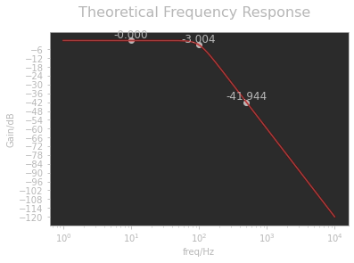
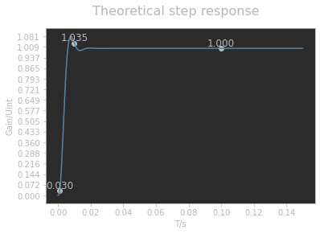
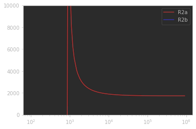
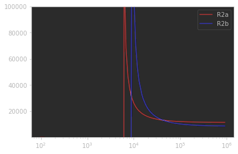
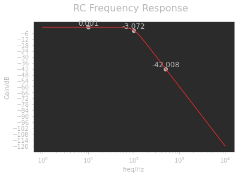
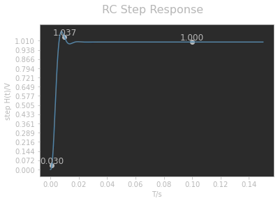
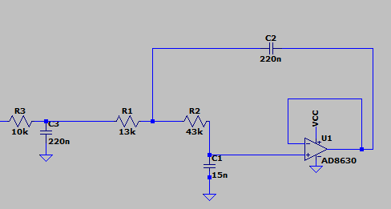
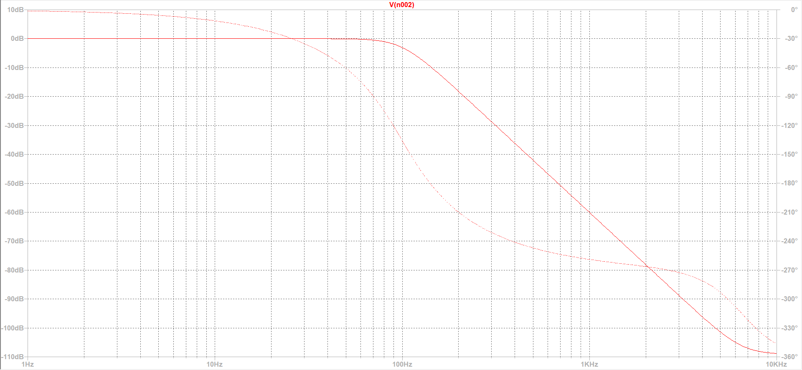
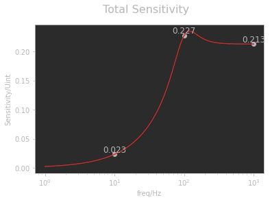
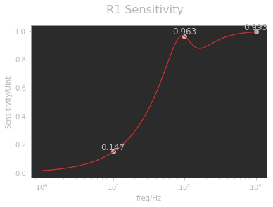

# Project Introduce
 
The project will help hardware engineers or student design a Sallen-Kay 3-Order filters with single amplifier. You can learn about how a Sallen-Kay 3-Order filter is designed.It also supports checking the time-domain and frequency-domain characteristics of the filter which you have designed.Finally, it helps you easily analyze the impact of tolerances of tolerances.

To Solve a filter in the figure,a classic approach is to preset that some component have the same value.But if you want to find different solution, you must make mathematical derivations.
In the project, we can solve the filter by preset **R1,C1,C3**.

Notice:So far, The project only support design of a unity gain Sallen-Kay 3-Order filters with single amplifier.
 
## Getting Started

```
pip install SallenKey3OrderSingleRCLPFDedinger
```

### Prerequisites
 
The project requires importing 3 necessary libraries.We suggest users configure the environment via Anaconda
 
```
pip install numpy
pip install scipy
pip install matplotlib
```
## Theoretical preparation
**H(s)** is the mathematical expression of the filter, we need to use capacitances and resistances to fit that **H(s)** you want.


## Running the tests
### Design and Check mathematical expression of the filter
 
Import the necessary libraries
 
```
from SallenKey3OrderSingleRCLPFDedinger.SallenKey3OrderSingleRCLPFDedinger import FilterDesign
import numpy as np
import matplotlib.pyplot as plt
```
Input poles of the filter and create an instance
```
# (The real part of the pole1,
#  The Natural frequency of the pole2&3,
#  The Damping factor of the pole2&3,
#  The Gain of the filter )
MFD = FilterDesign(100, 100, 0.5, 1)
f, hs = MFD.GetMathFreq(1, 10000, 10000)
```
 Check the time-domain and frequency-domain characteristics

Bode plot:
```
# (start Freq,Total Points,end Freq)
f, hs = MFD.GetMathFreq(1, 10000, 10000)
# 20:scale of ordinate ,could be 0 :Adaptive
# [100, 10, 500]:cursor list, will be marked on the points you select
MFD.ShowFreq(f,hs,"Theoretical Frequency Response","freq/Hz", "Gain/dB", 20, [100, 10, 500])
```


Step Plot:
```
# (Start time,Minimum interval,End time)
Math_step_t, Math_step_ht=MFD.GetMathTime(0,5E-6,1.5E-1)
MFD.ShowMTime(Math_step_t,Math_step_ht,"Theoretical step response","T/s","Gain/Uint",15,[1E-3,1E-2,1E-1])
```


You can also check poles:
```
print([MFD.ps1,MFD.ps2,MFD.ps3])
```
[-628.3185307179587, (-314.1592653589793+544.1398092702653j), (-314.1592653589793-544.1398092702653j)]
### Design RC filter
 
Prepare a resistance list
 
```
Rlist = np.array(
    [100, 110, 120, 130, 150, 160, 180, 200, 220, 240, 270, 300, 330, 360, 390, 430, 470, 510, 560, 620, 680, 750, 820,
     910,
     1000, 1100, 1200, 1300, 1500, 1600, 1800, 2000, 2200, 2400, 2700, 3000, 3300, 3600, 3900, 4300, 4700, 5100, 5600,
     6200, 6800, 7500, 8200, 9100,
     10000, 11000, 12000, 13000, 15000, 16000, 18000, 20000, 22000, 24000, 27000, 30000, 33000, 36000, 39000, 43000,
     47000, 51000, 56000
        , 62000, 68000, 75000, 82000, 91000,
     100000, 110000, 120000, 130000, 150000, 160000, 180000, 200000, 220000, 240000, 270000, 300000, 330000, 360000,
     390000, 430000, 470000
        , 510000, 560000, 620000, 680000, 750000, 820000, 910000])
```
Try to solve filter
```
# (R1,C1,C2,Rlist,
Acceptable error(AE): there are 2 roots R2a and R2b，solutions are all (R2a+R2b)/2 that conform to ABS(R2a-R2b)<AE)
flag, flist, R2a, R2b = MFD.SolveComponent(10000, 1e-6, 1e-6, Rlist, 100)
``` 
Check the solutions, The intersection of curves R2a and R2b is the solution to the filter.If R2a and R2b have no intersection,
you should change **R1,C1,C2** to find the solution.This process may seem cumbersome, but it takes the place of you deriving the formula
```
if flag == True:
    print("Solved successfully:")
    print(flist)
else:
    print("Solved unsuccessfully")
    plt.semilogx(Rlist, R2a, c='red',label='R2a')
    plt.semilogx(Rlist, R2b, c='blue',label='R2b')
    plt.ylim((-1E1, 1E4))
    plt.legend()
    plt.show()
```
Solved unsuccessfully



```
flag, flist, R2a, R2b = MFD.SolveComponent(10000, 2.2e-7, 2.2e-7, Rlist, 100)
if flag == True:
    print("Solved successfully:")
    print(flist)

    plt.semilogx(Rlist, R2a, c='red',label='R2a')
    plt.semilogx(Rlist, R2b, c='blue',label='R2b')

    plt.ylim((100, 1E5))
    plt.legend()
    plt.show()

```
Solved successfully:

[[10000, 13030.026054497392, 43000, 2.2e-07, 2.2e-07, 1.489417544705754e-08]]


## Verify
 
```
RC_freqres_f, RC_freqres_hs, RC_step_t, RC_step_h, polylist =\
    MFD.EvalFilter([10000, 13000, 43000, 2.2e-07, 2.2e-07, 1.5e-08],1,1, 10000, 10000,0,5E-6,1.5E-1)
MFD.ShowFreq(RC_freqres_f,RC_freqres_hs,"RC Frequency Response","freq/Hz", "Gain/dB", 20, [100, 10, 500])
```

```
MFD.ShowMTime(RC_step_t, RC_step_h, "RC Step Response", "T/s", "step H(t)/V", 15, [1E-3,1E-2,1E-1])
```
 

Verify by LTspice XVII:



## Tolerance analysis
The sensitivity of the frequency response to component **x**

!

Thus, sensitivity of the frequency response to tolerance is


Where Tol_x is tolerance of component **x**

```
freqlist, TotalSen, Sen_R1_list, Sen_R2_list, Sen_R3_list, Sen_C1_list, Sen_C2_list, Sen_C3_list, Sen_Rf_list \
    , Sen_Rg_list = MFD.Gettolerance([10000, 13000, 43000, 2.2e-07, 2.2e-07, 1.5e-08],0,MFD.OpenImp, [0.12, 0.02, 0.02, 0.1, 0.1, 0.1, 0.02, 0.02],1, 1000, 1000)
MFD.Showtolerance(freqlist,TotalSen,"Total Sensitivity","freq/Hz","Sensitivity/Uint",10,[10,100,1000])

```

```
MFD.Showtolerance(freqlist,Sen_R1_list,"R1 Sensitivity","freq/Hz","Sensitivity/Uint",10,[10,100,1000])
```

 
